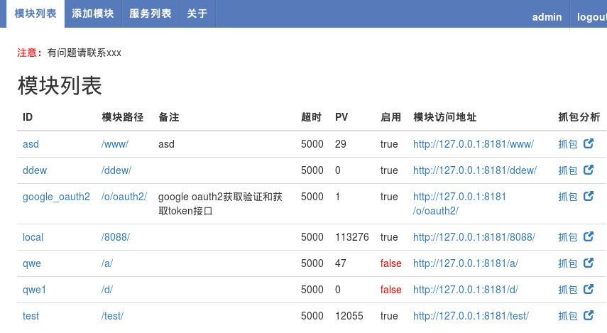
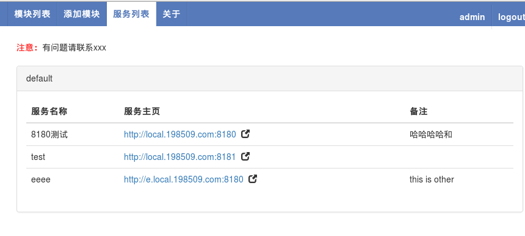

# api-front

version :0.8.1

## 概述
api front是HTTP API统一前端，用于测试环境api统一管理，主要功能是`请求代理转发`、`协议抓包分析`、`流量复制`。 

用于解决如下问题：

1. HTTP API大行其道,开发调试（特别是联调）花费的时间、人力成本很高。
2. 后端的API调用是一个黑盒，特别是有问题的时候，基本是抓瞎(目前一般是把请求信息记录到日志中去)。
3. 线下联调测试环境复杂多变，配置文件经常变动，经常其中一个环境好了另外一个又坏了。
4. 可将接口的请求历史记录全部记录方便排查问题。  
5. 对返回的结果进行修改，返回再返回给客户端。
     
## 两种典型应用场景：

### api输出
对外接口统一使用api-front管理，第三方通过api-front调用接口。有问题可随时抓包查看。  

### api接入  
接入外部依赖的api接口统一使用api-front管理，第三方环境变动可轻松切换，有问题也可随时抓包查看。


## 部署示例
  
api-front作为对外统一api入口。  
如上图，可打开页面  http:10.10.2.10/_/ 进行接口管理。(系统自己的接口，页面都是以_开头的)  

## 下载安装

使用go get命令安装：  
```
go get -u github.com/hidu/api-front
```

## 运行
```
api-front -conf ./conf/server.json
```


## 配置

### 主配置文件
<p>conf/server.json</p>
```
{
  "users":["admin"],
  "store_api_url":"http://127.0.0.1/test/store.php",
  "store_view_url":"http://127.0.0.1/test/view.php?host_id={host_id}&api_name={api_name}"
}
```
注：admin用户有所有权限。  
store_api_url: 远程保存请求详情的地址，发送post请求（同时需要下列子服务配置中的store=true才会生效）  
store_view_url: 查看接口历史数据的页面地址  


### 子服务配置
<p>conf/vhost/8080.json</p>
```
{
    "port": 8080,
    "group": "order",
    "name": "order api",
    "enable": true,
    "hidden_cookie": true,
    "note": "订单相关接口",
    "users": [
        "test"
    ]
    "store":true
}
```
访问 http://127.0.0.1:8080/ 即可进入管理页面。  
注：test用户有当前子服务的所有权限。


### 用户配置
文件名：conf/users  ，普通文本文件：  
```
id:admin psw_md5:7bb483729b5a8e26f73e1831cde5b842 psw:psw
id:test psw_md5:7bb483729b5a8e26f73e1831cde5b842 psw:psw
```
修改服务配置需要登陆。

### 登陆控制
默认是采用普通的用户名/密码的认证方式（使用conf/users用户表）。  
目前已经支持oauth2来登陆认证，若配置oauth2信息并且enable=true则使用oauth2登陆以进行权限控制。  
`conf/server.json` 配置如下：  
```
{
"users":["xxxx"],
"oauth2":{
  "type":"google",
   "enable":true,
  "client_id":"your client id",
  "client_sk":"your client secret key",
  "scopes":["openid", "email"],
  "auth_url":"https://accounts.google.com/o/oauth2/v2/auth",
  "token_url":"https://accounts.google.com/o/oauth2/token",
   "broken_auth_header":false,
  "apis":{
      "user_info":{
        "url":"https://www.googleapis.com/oauth2/v3/userinfo",
        "field_map":{
            "id":"email"
        }
      }
  }
}
}

```
broken_auth_header：获取token时是否不支持header模式  

apis/user_info/field_map属性是用来进行属性映射的，以解决不同系统返回用户信息不一致的问题，默认值如下：
```
    //标准名字，当前名字
    "id":        "id",
    "nick_name": "name",
    "email":     "email",
    "picture":   "picture",
```

###说明
hidden_cookie:在使用协议抓包分析(analysis)是输出到前端的cookie值是否隐藏起来。  

### 界面截图

  

服务列表：
  
