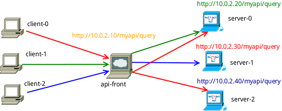
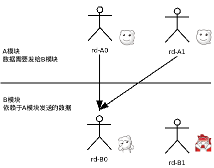
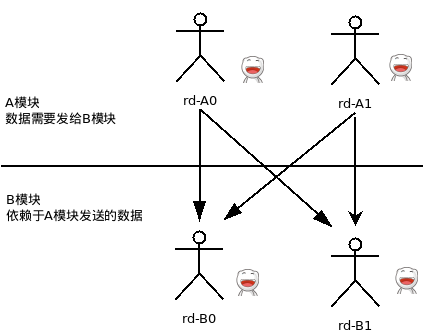

# api-front

version :0.6.5

## 概述
api front是HTTP API前端，可进行`请求代理转发`、`协议抓包分析`、`流量复制`。  
主要是用于开发测试环境,可用于：
#### api输出
对外接口统一使用api-front管理，第三方通过api-front调用接口。有问题可随时抓包查看。  

#### api接入  
接入外部依赖的api接口统一使用api-front管理，第三方环境变动可轻松切换，有问题也可随时抓包查看。


##部署示例
  
api-front作为对外统一api入口。  
如上图，可打开页面  http:10.10.2.10/_ 进行接口管理。(系统自己的接口，页面都是以_开头的)  

## 安装

### 下载二进制文件 
[网盘下载:windows、linux、darwin版本](http://pan.baidu.com/s/1pJJ5RHT)


### 使用源码安装
需要安装[golang](https://golang.org/dl/  "下载安装")  
使用go1.5,同时使用如下命令开启 vender功能：
```
export GO15VENDOREXPERIMENT=1
```

使用go get命令安装：  
```
go get -u github.com/hidu/api-front
```

## 运行
```
api-front -conf ./conf/server.json
```


##用途
###多人多模块开发演示
<p><code>1.一种情况：2个模块分别2个人开发，2个环境都能收到数据。</code></p>
  
<p><code>2.另一种情况：合作有交叉，下游一个人就收不到数据了。</code></p>
  
<p><code>3.一个理想的情况：合作有交叉时，下游每个人都能收到数据。</code></p>
  

##配置

###基本简单
每个端口配置一个apiserver:  
conf/server.json
```
{
"server":[
    {"port":8080,"enable":true,"name":"8080测试","note":"","hidden_cookie":true},
    {"port":8081,"enable":true,"name":"test","note":"","hidden_cookie":true,"users":["test"]},
    {"port":8083,"enable":true,"name":"test","note":"","hidden_cookie":true,"users":[":any"]},
],
"users":["admin"]
}
```
上述的admin有所有服务的管理权限，而test账户则只有8081端口的权限。  
port:8083 配置了用户 `:any`,即不登陆也可以管理。  


### 管理员用户配置
文件名：conf/users  ，普通文本文件：  
```
id:admin psw_md5:7bb483729b5a8e26f73e1831cde5b842
id:test psw_md5:7bb483729b5a8e26f73e1831cde5b842
```


###高级
虚拟主机方式，一个端口可以配置多个apiserver
<p>conf/server.json</p>
```
{
"server_name":"api.xxx.com",
"server":[
    {"port":8080,"enable":true,"name":"8080测试","note":"","hidden_cookie":true},
    {"port":8081,"enable":true,"name":"test","note":"","hidden_cookie":true,"sub_domain":"test"}
]
}

```
<p>conf/vhost/order_8081.json</p>
```
{"port":8081,"enable":true,"name":"order api","note":"","hidden_cookie":true}
```
通过 order.api.xxx.com:8081 和 test.api.xxx.com:8081访问 8081端口上的apiserver。  
vhost的子配置（如上`order_8081.json`）,格式是 `{subdomain}_{port}.json` 或者  `{port}.json`

###说明
hidden_cookie:在使用协议抓包分析(analysis)是输出到前端的cookie值是否隐藏起来。  
